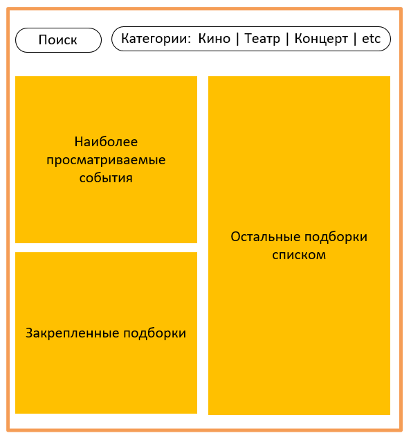

# Explore with me  — микросервисное приложение «Исследуй со мной» - афиша мероприятий
java, spring-boot, spring-jpa, lombook, rest-api, sql, docker, postgresql, postman 
## О проекте
Приложение для публикации информации об интересных событиях и поиска компаний для участия в них.

Свободное время — ценный ресурс. Ежедневно мы планируем, как его потратить — куда и с кем сходить. Сложнее всего в таком планировании поиск информации и переговоры. Нужно учесть много деталей: какие намечаются мероприятия, свободны ли в этот момент друзья, как всех пригласить и где собраться.

Данное приложение — афиша. В этой афише можно предложить какое-либо событие от выставки до похода в кино и собрать компанию для участия в нём.

Приложение состоит из двух микросервисов:
- main-service - для бизнес-логики
- stats - для сбора статистики просмотра событий по ip, который состоит из трех модулей

У каждого микросервиса есть своя база данных.  
Микросервисы и базы данных запускаются в собственных Docker контейнерах.

## Функциональность приложения

### Неавторизованные пользователи

- Получение всех событий
- Получение события по идентификатору
- Получение событий по условиям фильтрации
- Получение подробной информации о событии по идентификатору
- Получение списка категорий событий
- Получение информации о категории события по идентификатору

### Авторизованные пользователи

- Добавление события
- Изменение события
- Изменение статуса события
- Получение событий текущего пользователя
- Получение подробной информации по событию текущего пользователя
- Получение информации о запросах на участие в событии

### Администраторы

- Добавление категории события
- Удаление категории события
- Исправление категории события
- Поиск событий
- Редактирование события и изменение статуса
- Добавление подборки событий
- Удаление подборки событий
- Обновление информации о событии
- Регистрация пользователя
- Удаление пользователя
- Получение информации о пользователях

### Эндпоинты

#### main-service

- Public Подборки событий (Публичный API для работы с подборками событий):
  - GET /compilations - Получение подборок событий 
  - GET /compilations/{compId} - Получение подборки событий по его id

- Admin Категории (API для работы с категориями):
  - POST /admin/categories - Добавление новой категории 
  - DELETE /admin/categories/{catId} - Удаление категории 
  - PATCH /admin/categories/{catId} - Изменение категории

- Private События (Закрытый API для работы с событиями):
  - GET /users/{userId}/events - Получение событий, добавленных текущим пользователем 
  - POST /users/{userId}/events - Добавление нового события 
  - GET /users/{userId}/events/{eventId} - Получение полной информации о событии добавленном текущим пользователем 
  - PATCH /users/{userId}/events/{eventId} - Изменение события добавленного текущим пользователем 
  - GET /users/{userId}/events/{eventId}/requests - Получение информации о запросах на участие в событии текущего пользователя 
  - PATCH /users/{userId}/events/{eventId}/requests - Изменение статуса (подтверждена, отменена) заявок на участие в событии текущего пользователя

- Public Категории (Публичный API для работы с категориями):
  - GET /categories - Получение категорий 
  - GET /categories/{catId} - Получение информации о категории по её идентификатору

- Admin События (API для работы с событиями):
  - GET /admin/events - Поиск событий 
  - PATCH /admin/events/{eventId} - Редактирование данных события и его статуса (отклонение/публикация).

- Public События (Публичный API для работы с событиями):
  - GET /events - Получение событий с возможностью фильтрации 
  - GET /events/{id} - Получение подробной информации об опубликованном событии по его идентификатору

- Private Запросы на участие ()Закрытый API для работы с запросами текущего пользователя на участие в событиях:
  - GET /users/{userId}/requests - Получение информации о заявках текущего пользователя на участие в чужих событиях 
  - POST /users/{userId}/requests - Добавление запроса от текущего пользователя на участие в событии 
  - PATCH /users/{userId}/requests/{requestId}/cancel - Отмена своего запроса на участие в событии

- Admin Пользователи (API для работы с пользователями):
  - GET/admin/users - Получение информации о пользователях 
  - POST /admin/users - Добавление нового пользователя 
  - DELETE /admin/users/{userId} - Удаление пользователя

- Admin Подборки событий (API для работы с подборками событий):
  - POST /admin/compilations - Добавление новой подборки (подборка может не содержать событий)
  - DELETE /admin/compilations/{compId} - Удаление подборки 
  - PATCH /admin/compilations/{compId} - Обновить информацию о подборке

#### stats

- StatsController API для работы со статистикой посещений 
  - POST /hit - Сохранение информации о том, что к эндпоинту был запрос 
  - GET /stats - Получение статистики по посещениям. Обратите внимание: значение даты и времени нужно закодировать

### Описание базы данных
