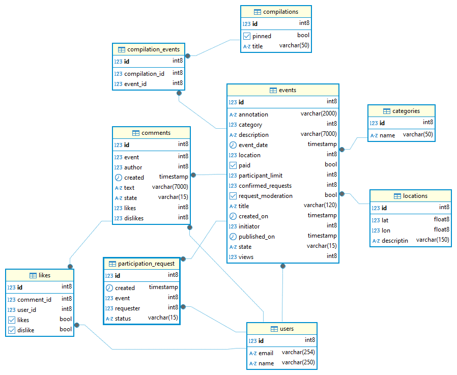

# Explore with me  — микросервисное приложение «Исследуй со мной» - афиша мероприятий
java, spring-boot, spring-jpa, lombook, rest-api, sql, docker, postgresql, postman 
## О проекте
Приложение для публикации информации об интересных событиях и поиска компаний для участия в них.

Свободное время — ценный ресурс. Ежедневно мы планируем, как его потратить — куда и с кем сходить. Сложнее всего в таком планировании поиск информации и переговоры. Нужно учесть много деталей: какие намечаются мероприятия, свободны ли в этот момент друзья, как всех пригласить и где собраться.

Данное приложение — афиша. В этой афише можно предложить какое-либо событие от выставки до похода в кино и собрать компанию для участия в нём.

Приложение состоит из двух микросервисов:
- main-service - для бизнес-логики
- stats - для сбора статистики просмотра событий по ip, который состоит из трех модулей

У каждого микросервиса есть своя база данных.  
Микросервисы и базы данных запускаются в собственных Docker контейнерах.

## Функциональность приложения

### Неавторизованные пользователи

- Получение всех событий
- Получение события по идентификатору
- Получение событий по условиям фильтрации
- Получение подробной информации о событии по идентификатору
- Получение списка категорий событий
- Получение информации о категории события по идентификатору

### Авторизованные пользователи

- Добавление события
- Изменение события
- Изменение статуса события
- Получение событий текущего пользователя
- Получение подробной информации по событию текущего пользователя
- Получение информации о запросах на участие в событии

### Администраторы

- Добавление категории события
- Удаление категории события
- Исправление категории события
- Поиск событий
- Редактирование события и изменение статуса
- Добавление подборки событий
- Удаление подборки событий
- Обновление информации о событии
- Регистрация пользователя
- Удаление пользователя
- Получение информации о пользователях

### Описание базы данных
